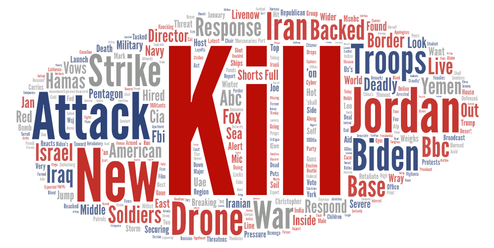
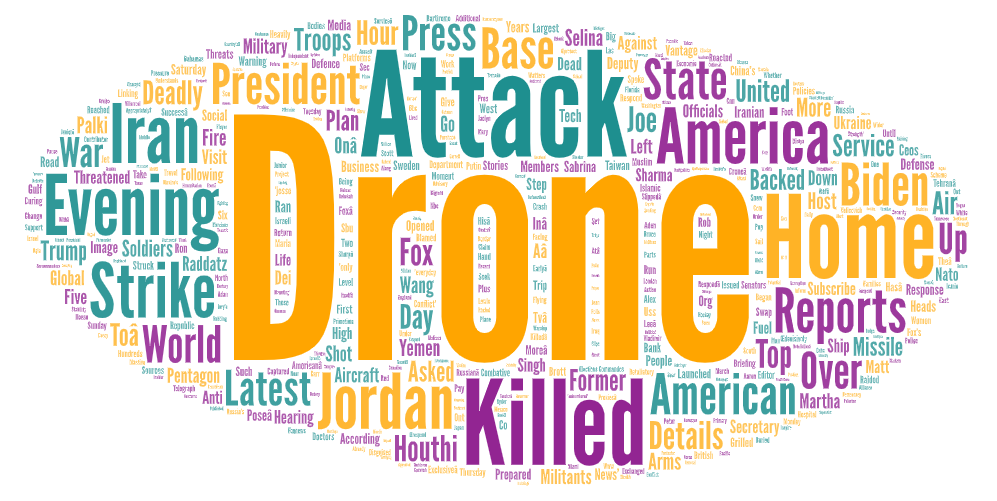

# News: Locally, Domestically, Internationally

**Narrative:**

In an effort to understand the dynamics of news coverage at different scales, I embarked on a comparison of local, domestic, and international news using the search terms "Seattle news," "US news," and "world news." The motivation behind this exploration was to delve into the focus and themes prevalent in news subjects on both a small and large scale, contemplating how these themes could potentially shape public perception.

  
   
  

  <em>Seattle News</em>, <em>US News</em>, <em>World News</em>

Upon analyzing the word clouds generated from the search results, distinct patterns emerged. Seattle news appeared to prominently feature crime and sports, with a particular emphasis on local sports teams, such as the Seahawks. Interestingly, sports did not carry the same weight in the broader U.S. news landscape, where political coverage and crime stories seemed to dominate. Similarly, international news mirrored the U.S. focus on politics, crime, and the nation's involvement globally, reflecting a U.S.-centric lens.

The observed patterns could be attributed to the dynamic nature of news. Events like a recent drone strike on a U.S. base in Jordan might explain the prevalence of military and international themes in both U.S. and world news. Locally, the notable change in the Seahawks' coaching staff, from Pete Carroll to Mike MacDonald, emerged as a significant topic, given Carroll's decade-long tenure and the Seahawks' role as a shared source of pride in the Seattle community.

As I reflect on the research, it becomes evident that the exploration could be enhanced in the future. To mitigate the bias inherent in U.S.-centric perspectives, incorporating additional search terms that provide a more global viewpoint is crucial. Utilizing unbiased terms and perhaps exploring news platforms beyond YouTube might offer a more comprehensive understanding. Alternately, comparing search results on YouTube with those from other websites or employing VPNs from different countries could further enrich the analysis.

This exercise also highlighted the need to acknowledge unexpected findings. For instance, while I anticipated a U.S. bias in international news, the degree to which it permeated local and domestic news was noteworthy. It prompts a critical examination of the sources and platforms used for news consumption, raising questions about the impact of bias and the necessity for diverse perspectives in understanding global affairs.
